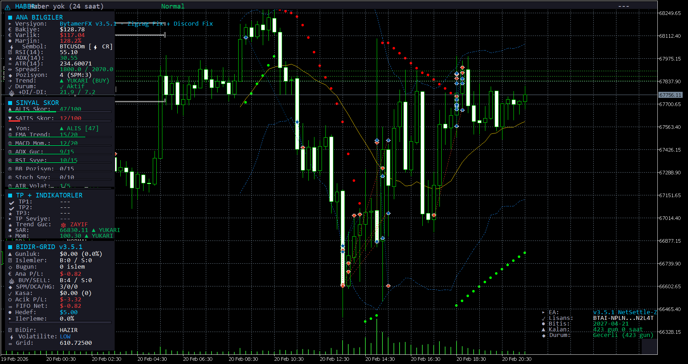
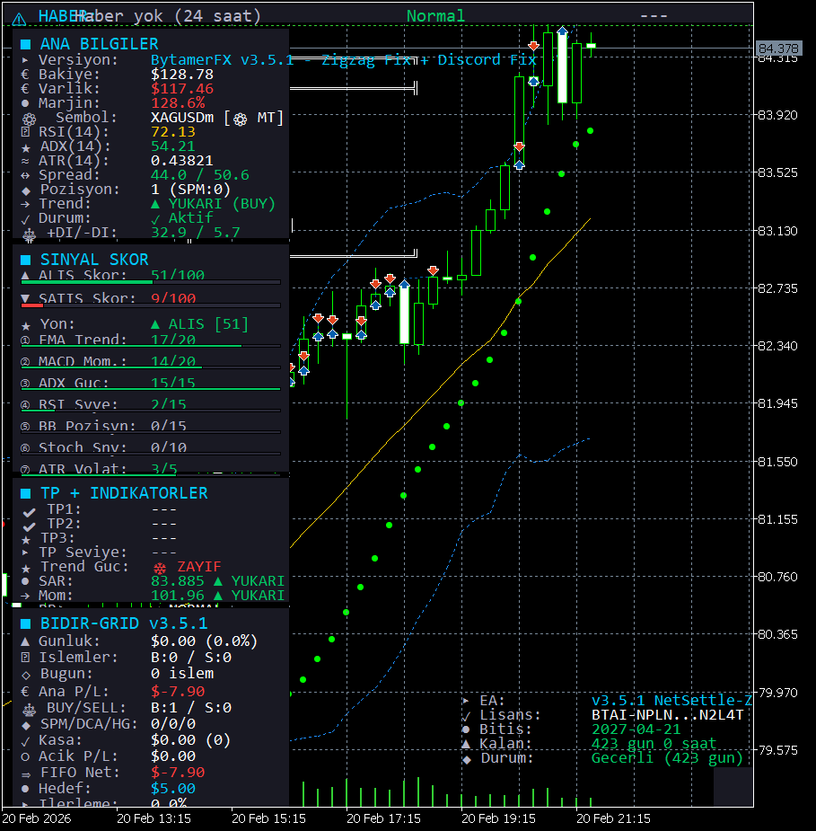

# BytamerFX - Expert Advisor for MetaTrader 5

**BytamerFX v3.5.1** - Professional automated trading system with Zigzag Grid + Net Settlement technology.

> **Zigzag SPM** | **Net Settlement** | **FIFO Engine** | **Trend Hold** | **Multi-Instrument** | **License Protected**

---

## Screenshots

### BTCUSDm - Crypto Dashboard

### XAGUSDm - Silver Dashboard

---

## Overview

BytamerFX is a professional-grade Expert Advisor for MetaTrader 5 that combines trend-following signals with an intelligent zigzag grid management system. The EA uses a hybrid approach of signal scoring, ATR-based grid spacing, and automated position management to generate consistent returns.

## Key Features

### Zigzag Grid System (v3.5.0+)
- **Zigzag SPM**: ANA BUY → SPM1 BUY → SPM2 SELL → SPM3 BUY (alternating directions)
- Every price movement benefits one side of the grid
- Dual trigger system: $ loss OR ATR distance (whichever comes first)
- ADX 25+ required for grid activation (strong trend filter)

### Net Settlement Engine
- **FIFO**: Kasa + ANA loss >= $5 → close ANA position
- **Net Settlement**: Kasa + worst position loss >= $5 → close worst position
- Any position (ANA, SPM, DCA) can be settled via Net Settlement
- Automatic promotion: oldest SPM becomes new ANA after settlement

### Trend-Aware Trading
- 3-source voting system (EMA + MACD + ADX DI) with consecutive confirmation
- H1/H4 multi-timeframe trend filter with ±15-30% score adjustments
- **Trend Hold**: Strong trend + position in trend direction → HOLD until candle reversal
- **Max Close**: Close at peak value when candle reverses

### 7-Layer Signal Scoring Engine
- 12 indicator handles across M15, H1, H4 timeframes
- EMA Trend (20pts), MACD Momentum (20pts), ADX Strength (15pts)
- RSI Level (15pts), BB Position (15pts), Stochastic (10pts), ATR Volatility (5pts)
- Minimum score threshold: 40/100

### Smart Risk Management
- **SL = NONE (ABSOLUTE)** - No stop loss, ever
- Role-based profit protection (MAIN/SPM/DCA differentiated)
- Peak/Dip protection: RSI > 75 or < 25 + ADX < 30 = grid blocked
- Spread control: rejects if spread > ATR-based normal × 1.15
- 15-second candle wait before new grid positions
- 60-second cooldown after all positions closed
- Balance-based and ADX-based grid limits

### 10 Instrument Profiles
| Category | SPM Trigger | SPM TP | Examples |
|----------|-------------|--------|----------|
| Forex | -$4 | $3 | EURUSD, GBPUSD, AUDUSD |
| Forex JPY | -$4 | $3 | USDJPY, EURJPY, GBPJPY |
| Silver | -$5 | $4 | XAGUSD |
| Gold | -$5 | $4 | XAUUSD |
| Crypto | -$5 | $4 | BTCUSD, ETHUSD |

### Real-Time Dashboard
- 4-panel dashboard with live data (ANA BILGILER, SINYAL SKOR, TP+INDIKATORLER, BIDIR-GRID)
- Full-width news banner with impact-based color coding
- License panel with dynamic color (green/orange/yellow/red by days remaining)
- Chart overlay: Bollinger Bands, Parabolic SAR dots, Momentum

### Notifications
- Telegram integration (rate limited: 15 msg/min)
- MT5 push notifications

---

## Supported Instruments

| Category | Examples |
|----------|----------|
| Forex | EURUSD, GBPUSD, AUDUSD, EURGBP |
| Forex JPY | USDJPY, EURJPY, GBPJPY |
| Metals | XAUUSD (Gold), XAGUSD (Silver) |
| Crypto | BTCUSD, ETHUSD, LTCUSD |
| Indices | US30, NAS100, SPX500 |
| Energy | USOIL, UKOIL |

---

## Installation

1. Download `BytamerFX.ex5` from [Releases](releases/)
2. Copy to your MT5 Experts folder
3. In MT5: **Tools > Options > Expert Advisors** > Allow WebRequest for `https://bytamer.com`
4. Drag EA onto chart and enter your license key

See [Installation Guide](docs/installation.md) for detailed instructions.

---

## License & Pricing

BytamerFX is **commercial software** protected by an online license verification system.

### How It Works
- Each license key is tied to a **specific broker account number**
- License validity is verified in real-time via `https://bytamer.com` API
- The EA checks license status on every startup
- Dashboard displays license status with color-coded indicators:
  - **Green**: 15+ days remaining
  - **Orange**: 7-14 days remaining
  - **Yellow**: 3-6 days remaining
  - **Red**: Less than 3 days remaining

### License Plans
- Licenses are issued on a **monthly basis** (max 30 days per cycle)
- Each license is valid for **one MT5 account** on a specific broker
- License renewal is required before expiration to avoid trading interruption

### Get Your License

> **Visit [www.bytamer.com](https://www.bytamer.com) for pricing and license purchase.**
>
> Start trading with BytamerFX's professional-grade Zigzag Grid + Net Settlement engine today.

---

## Support

- **Email**: info@bytamer.com
- **Telegram**: @ByTamerAI_Support
- **Twitter/X**: [@ntamero](https://twitter.com/ntamero)
- **Website**: [bytamer.com](https://bytamer.com)

---

## Version History

| Version | Date | Highlights |
|---------|------|------------|
| v3.5.2 | 2026-02-21 | Security hardening, notification cleanup |
| v3.5.1 | 2026-02-21 | Zigzag distance fix, dual trigger |
| v3.5.0 | 2026-02-20 | Zigzag Grid + Net Settlement Engine (11 Rules) |
| v3.4.0 | 2026-02-20 | Bi-Directional Grid + Smart Profit Engine |
| v3.3.0 | 2026-02-20 | Hybrid profitability + Security hardening |
| v3.2.0 | 2026-02-20 | License system + Balance-based trading |
| v3.1.0 | 2026-02-19 | Bi-Directional Trend-Grid system |
| v2.0.0 | 2026-02-17 | WIN-WIN Hedge System |
| v1.0.0 | 2026-02-17 | Initial release |

---

## Disclaimer

> **This software is not investment advice.** Forex and CFD trading involves high risk. Past performance does not guarantee future results. Make investment decisions based on your own research.

---

**Copyright 2026, By T@MER** | [bytamer.com](https://bytamer.com)
