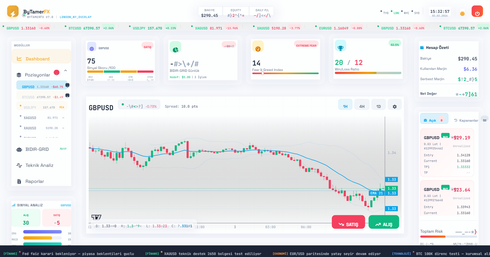
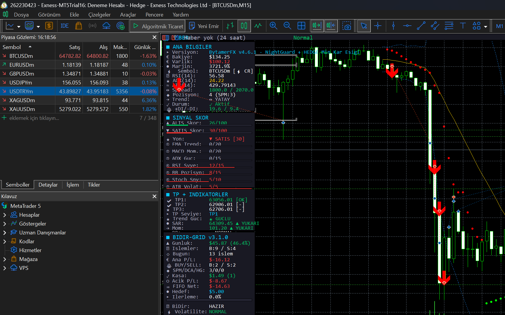

# ByTamerFX - Expert Advisor for MetaTrader 5

**BytamerFX v4.7.7 — SystemOverhaul** - Professional automated forex trading system with hybrid signal engine + zigzag SPM recovery + smart FIFO candle reversal + balance-adaptive lot scaling + trend-aware hedge control.

> **NO SL** | **Never close at a loss** | **Zigzag SPM Recovery** | **Smart FIFO** | **Balance-Adaptive Lots** | **Candle Reversal Protection** | **Crypto 7/24** | **Night Mode (20:00+)**

---

## Screenshots

### BytamerFX Dashboard v4.7.7 — Real-Time Web Interface


*Gold lightning bolt branding, 5-tab sidebar (Dashboard / Pozisyonlar / BIDIR-GRID / Teknik Analiz / Raporlar), real-time charts, live system logs, news ticker, TextScramble animations*

### MetaTrader 5 — EA Dashboard Overlay


---

## Core Philosophy

- **SL = YOK (MUTLAK)** — No Stop Loss on any position, ever
- **Zararina Satis YOK** — Normal operation never closes positions at a loss
- **SPM/FIFO Zarar Yonetimi** — Losses managed through SPM accumulation + FIFO offset
- **Zigzag SPM Kurtarma** — Alternating direction SPM layers (SPM1=MAIN, SPM2=reverse, SPM3=reverse)
- **Grid Reset & EQUITY_ACIL** — Extreme safety nets only (last resort, not normal operation)

---

## Features

### Signal Engine - ByTamer Hybrid Signal System (BHSS)
- **12 indicator handles** (M15 + H1 + H4 multi-timeframe)
- **BytamerFX combo scoring** (0-100 points, min 40 entry threshold)
- EMA Ribbon (8/21/50) + MACD + RSI + ADX + Bollinger + Stochastic + ATR
- SuperTrend + Ichimoku + Keltner Channel + MFI + Parabolic SAR
- Candlestick pattern detection (Pin Bar, Engulfing, Doji, Inside Bar)
- Market Structure analysis (HH/HL/LH/LL)
- MACD + RSI divergence engine (regular + hidden)

### Position Management - KazanKazan-Pro (v4.7.7)
- **Zigzag SPM Pattern**: SPM1=MAIN direction (DCA), SPM2=reverse, SPM3=reverse again (alternating)
- **Layer-Based Triggers**: Each SPM triggers on PREVIOUS SPM's own loss (not MAIN loss)
- **SPM Max 3 Layers**: Deeper recovery with controlled risk
- **Smart FIFO**: SPM profits accumulate to offset main loss (net >= +$5 closes MAIN)
- **FIFO Candle Reversal**: If candle turns toward MAIN → don't close MAIN, close wrong-side SPM instead
- **Balance-Adaptive Lots**: $100-200: 1.0x, $200-500: 1.2x, $500-1000: 1.4x lot scaling
- **Rescue Hedge**: SPM2 loss threshold triggers hedge with trend+signal+candle voting
- **Smart Hedge Timeout**: 3-tier profit targeting ($2 min / $5 target) + trend direction awareness
- **Grid Reset**: Total floating loss exceeds threshold → orderly close all
- **SPM Terfi**: After FIFO closes MAIN, oldest SPM promotes to new MAIN + grid direction auto-update

### Dynamic Profile System (10 Profiles)
- Forex, ForexJPY, Silver, Gold, Crypto, CryptoAlt, Indices, Energy, Metal, Default
- Profile-based: SPM trigger, lot, cooldown, grid reset thresholds
- 3-Tier Matching: Symbol-specific > JPY group > Category priority

### Night Session Protection (v4.6.0+)
- **20:00+ Trade Block**: No new positions for non-crypto symbols after 20:00 local time
- **23:00 Force Close**: All profitable non-crypto positions closed at 23:00 (min +$1)
- **Crypto 24/7**: Bitcoin and altcoin trading continues without restrictions
- **Purpose**: Protection against regional exchange opening volatility and spread spikes

### Safety Systems
- **3-Level Margin Protection**: %300 warning → %150 emergency → %30 equity critical
- **Grid Reset**: `-max($30, equity * 25%)` floating loss → orderly grid reset
- **Recovery Mode**: After emergency, no new trades for 24h or until 50% balance recovery
- **News Filter**: Trade blocking during CRITICAL/HIGH impact economic events
- **Spread Control**: ATR-normalized spread x MaxSpreadMultiplier (1.15)

### MIA — Market Intelligence Agent (Python)
- **Multi-agent architecture**: SpeedAgent + RiskAgent + GridAgent
- **AI Brain**: Decision engine with market context awareness
- **BytamerFX Dashboard v4.7.7**: Real-time web interface (Tailwind CSS + LightweightCharts + 5-tab sidebar)
- **DashboardRT Thread**: 500ms real-time price, spread, and position updates
- **Telegram Commander**: Remote control via Telegram bot
- **News Manager**: Economic calendar integration with impact-based filtering
- **Sentiment Engine**: Market sentiment analysis with Fear & Greed index

### Notifications
- Telegram (HTML format + emoji + balance/equity info, rate limited)
- Discord (Embed format + color-coded + balance/equity info)
- MT5 Push Notification

---

## Technical Specifications

| Property | Value |
|----------|-------|
| Platform | MetaTrader 5 (Build 5200+) |
| Language | MQL5 + Python 3.x |
| Timeframe | M15 (entry) + H1/H4 (filter) |
| Min Balance | $10 |
| Min Signal Score | 40/100 |
| SPM Max Layers | 3 (per profile, configurable) |
| FIFO Net Target | $5 (adaptive by balance) |
| Grid Reset Threshold | -max($30, 25% equity) |
| Margin Warning | <300% (block new positions) |
| Margin Emergency | <150% (close all) |
| Equity Emergency | <30% (close all + recovery mode) |
| SPM Trigger | Forex: -$4, USDJPY: -$3, BTC/Metal: -$5 |
| Min Lot | Forex: 0.03, Metal/Crypto: 0.01 |
| Profile Count | 10 instrument profiles |
| Indicators | 12 (BHSS combo scoring) |
| Dashboard | Real-time web UI (port 8765) |
| MIA Agents | SpeedAgent + RiskAgent + GridAgent |

---

## Architecture

```
BytamerFX/
├── BytamerFX.mq5              # Main EA (v4.7.7 SystemOverhaul)
├── Config.mqh                 # Central configuration + 10 SymbolProfiles
├── SignalEngine.mqh           # 12-indicator BHSS hybrid signal system
├── PositionManager.mqh        # Zigzag SPM + Smart FIFO + Grid Reset
├── TradeExecutor.mqh          # Trade execution (SL=0 absolute)
├── NewsManager.mqh            # Universal News Intelligence
├── ChartDashboard.mqh         # MT5 on-chart dashboard overlay
├── + 8 more modules           # Security, spread, lot calc, notifications...
│
├── MIA/                       # Market Intelligence Agent (Python)
│   ├── main.py                # MIA Orchestrator (multi-agent)
│   ├── dashboard_api.py       # Real-time WebSocket API (port 8765)
│   ├── dashboard_miav89.html  # BytamerFX Dashboard v4.7.7 (5-tab UI)
│   ├── brain.py               # AI Brain decision engine
│   ├── agents.py              # SpeedAgent + RiskAgent + GridAgent
│   ├── mt5_bridge.py          # MT5 Python API bridge
│   └── + 10 more modules      # Grid, sentiment, telegram, signals...
│
└── screenshots/               # Dashboard & EA screenshots
```

> **Note:** Source code is proprietary. This repository serves as a project showcase.

---

## Version History

See [CHANGELOG.md](CHANGELOG.md) for detailed changes.

| Version | Date | Description |
|---------|------|-------------|
| **v4.7.7** | **2026-03-03** | **SystemOverhaul — Zigzag SPM + Smart FIFO + Balance Lot Scaling** |
| v4.7.6 | 2026-03-03 | HedgeSmart — Akilli Hedge Timeout + Trend Koruma |
| v4.7.5 | 2026-03-03 | PromotionFix — Terfi sonrasi grid yon guncelleme |
| v4.7.4 | 2026-03-02 | CryptoFreedom — Crypto haber blogu muafiyeti + MIA Dashboard v7 |
| v4.7.3 | 2026-03-02 | AntiSpam + Dashboard Redesign — Global Trade Guard + UI Overhaul |
| v4.7.1 | 2026-03-01 | HEDGE-Safe — Hedge zararina satis yasagi |
| v4.7.0 | 2026-03-01 | FIFO-Guard — Kasa Persistence + Restart Koruma |
| v4.6.1 | 2026-02-28 | NightGuard — Night Session Protection + HEDGE Min Profit |
| v4.6.0 | 2026-02-27 | NightGuard — Crypto haric 20:00 trade block + 23:00 force close |
| v4.5.0 | 2026-02-27 | All file headers updated |
| v4.4.0 | 2026-02-26 | Full versioning and file synchronization |
| v4.3.2 | 2026-02-26 | FIFO Kasa Fix + BE Lock Fix + Min Profit |
| v4.2.0 | 2026-02-26 | Net-Exposure SPM + Grid Reset + EQUITY_ACIL Fix |
| v4.0.0 | 2026-02-23 | KazanKazan-Pro: 12 indicator + progressive recovery |
| v3.5.0 | 2026-02-21 | Net Settlement + Zigzag Grid Engine |
| v3.0.0 | 2026-02-20 | Trend-Grid System |
| v2.0.0 | 2026-02-17 | WIN-WIN Hedge System |
| v1.0.0 | 2026-02-17 | Initial release |

---

## Disclaimer

> **This software is not investment advice.** Forex and CFD trading involves high risk. Past performance does not guarantee future results. Make investment decisions based on your own research.

---

**Copyright 2026, By T@MER** | [www.bytamer.com](https://www.bytamer.com) | [GitHub](https://github.com/ntamero/ByTamerFX) | [Telegram](https://t.me/ByTamer)
