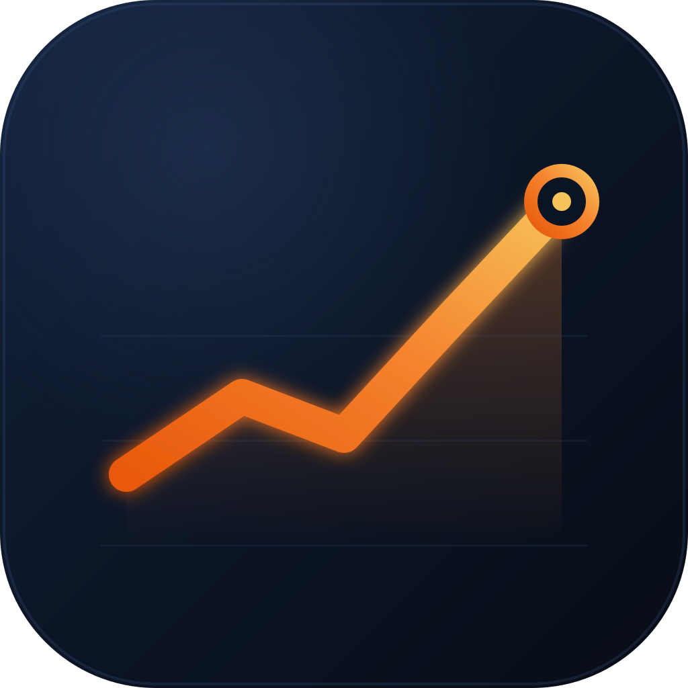
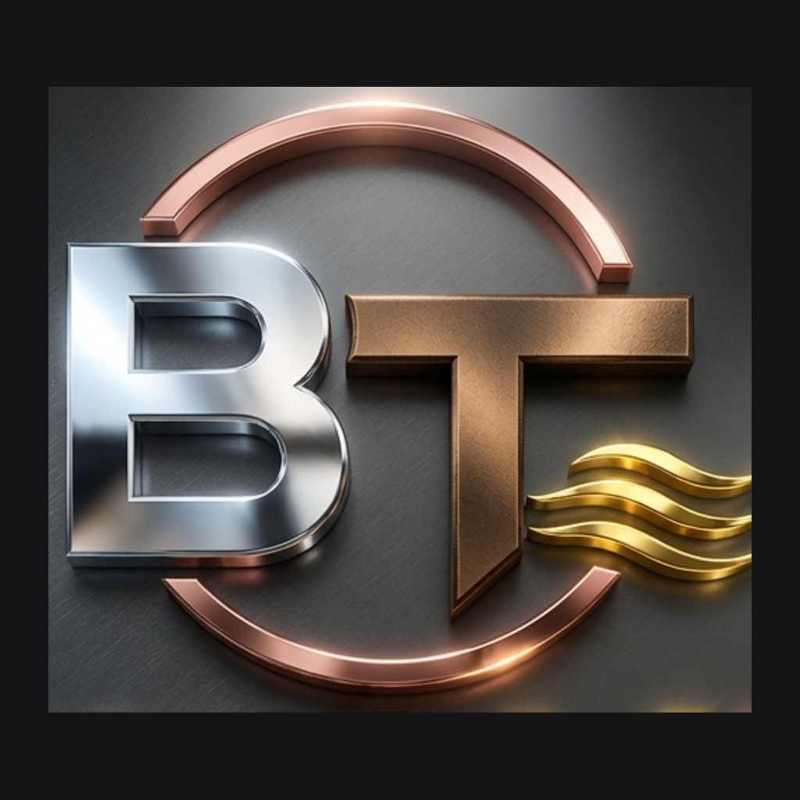

# ByTamerFX - Expert Advisor for MetaTrader 5

**BytamerFX v7.7.6 — Drawdown Opportunity Scalp (DOS)** — Professional automated trading system with a **15-layer intelligence stack** for crypto/forex/metals. No stop-loss, recovery via SPM + HEDGE + FIFO orchestration. The new **DOS engine** turns drawdown into opportunity: when the account is in drawdown *and* a strong, fresh, HTF-aligned signal appears, it opens a small isolated scalp **in the direction of the move** and banks $8–10 straight to the vault (kasa) on a QuickTP hit or an M5 candle reversal — no top-guessing required. Live results proved the concept (**+$300 realized, 94% win-rate, 100% on silver**), so the older top-fade module (**SpikeFade**) was retired in favor of DOS. All add-on engines filter or trade **isolated** positions only — zero changes to core rules (NO-SL, SPM, FIFO, kasa).

> **NO SL · NO Force Close** | **Drawdown Opportunity Scalp** | **Signal Momentum Lock** | **Multi-TF Reversal Detection** | **Alpha Engine** | **Companion Mobile Apps** | **Crypto 7/24**

## v7.7.x — Drawdown Opportunity Scalp Series (2026-07-12 → 13)

The v7.7 line adds a **profit engine that thrives in adverse conditions** — the opposite of a defensive layer.

| Feature | Trigger | Action |
|---------|---------|--------|
| **DOS Entry** (v7.7.0) | Drawdown ≥ 3% + signal score ≥ 50 + fresh (< 15 min) + HTF-aligned | Open small isolated scalp in move direction (magic +6000) |
| **DOS QuickTP** | Open scalp reaches +$8–10 | Close → send profit to vault (kasa) |
| **DOS Candle Exit** | M5 candle reverses against the scalp | Close at peak → vault (never at a loss on timeout) |
| **Momentum Filter** (v7.7.5) | Last M5 candle must confirm direction + not decelerate | Block late/exhausted entries |
| **Equity-Tier Lot** | Balance-scaled sizing | <$200: 0.02–0.04 · $200–500: 0.04–0.08 · $500–1K: 0.08–0.12 · $1K+: 0.12–0.20 |
| **Metal Fixed Lot** | XAU / XAG scalps | Fixed 0.02 lot (volatility-safe) |
| **SpikeFade Retired** (v7.7.6) | — | Disabled — DOS does the "profit-on-extreme" job with a 94% win-rate |

**Why it works:** classic "fade the top" systems must call the exact reversal — mathematically hard, so they misfire. DOS never predicts the top. It rides an already-extended move with a tiny lot, grabs a fast $8–10, and exits the instant an M5 candle turns. Realized proof over 35 trades: **+$300.13, 94% WR** (silver 16/16 = 100%, crypto 89%).

## v6.0.x — Signal Reversal Protection Layer (2026-05-17)

The v6.0 release adds **3 critical protections** against the "profitable trade turns into loss" problem:

| Feature | Trigger | Action |
|---------|---------|--------|
| **Signal Momentum Drop Check** | Pre-entry: peak/current < 0.65 | REJECT new trade (momentum dying) |
| **Multi-TF Reversal Check** | Pre-entry: M1/M3/M5/M10 candles 60%+ opposite | REJECT new trade (reversal in progress) |
| **Signal Reversal Exit** | Post-entry: signal flipped + profit > $1 | CLOSE main early (lock profit) |

**Reversal Trap Detector** (v5.9.18) also active:
- ADX < 25 + RSI extreme + candle just reversed → REJECT (peak/dip trap)

**Architectural protections:**
- SPM Layer 3 forced opposite direction (built-in hedge)
- OSA (One-Sided Accumulation) lot ratio check (3.5x threshold)
- Tester GlobalVariable cleanup (deterministic backtests)
- MFI Gate removed from code (replaced with smarter Reversal Trap Detector)
- HedgeBoost disabled (fixed 0.10 lot rounding bug)

## v5.9.x Iteration Series — User Customization (20+ versions in 1 day)

Major user-driven refinements:
- **v5.9.20**: Progressive lots restored (1.0/1.1/1.2/1.3) + OSA protection enabled
- **v5.9.19**: MFI Gate hard-disabled in code (input override impossible)
- **v5.9.18**: Reversal Trap Detector (smart MFI replacement)
- **v5.9.16-17**: Signal cooldown-based (no longer dependent on M15 new bar)
- **v5.9.14-15**: User final settings — BTC lot 0.04, Forex 0.06, MinScore 45
- **v5.9.12**: HedgeBoost OFF (critical 0.10 lot bug fix)
- **v5.9.10-11**: A-A-T-A SPM direction pattern + early hedge architecture
- **v5.9.5**: Baseline architecture — proved breakeven (-$0.27) in backtest
- **v5.9.1**: Tester GlobalVariable cleanup for deterministic backtests

## v5.6.4 → v5.8.0 Journey (3 days, 5 major releases)

| Version | Date | Key Innovation |
|---------|------|----------------|
| **v5.6.4** | 2026-05-13 | No Force Close + Basic Recovery Boost |
| **v5.7.0** | 2026-05-13 | Quantum Recovery: Microstructure + Maturity + Session |
| **v5.7.5** | 2026-05-13 | Probabilistic Edge: Correlation + HTF + EV + Liquidity |
| **v5.8.0** | 2026-05-13 | **Alpha Engine: Pure Mathematics (Hurst + Markov + Z-Score)** |

### The Alpha Engine Stack (v5.8.0)

```
Layer 1: SignalEngine (12-indicator hybrid)
Layer 2: MicrostructureEngine (tick volume + wick rejection + traps)
Layer 3: TrendMaturity (BIRTH → EXHAUSTED detector)
Layer 4: SessionFilter (London/NY/Asia/Overlap)
Layer 5: CorrelationEngine (BTC↔ETH↔Gold confluence)
Layer 6: HigherTimeframeBias (D1 + W1 filter)
Layer 7: ExpectedValueCalc (Kelly-Lite sizing)
Layer 8: LiquidityZones (swing high/low magnets)
Layer 9: HurstExponent (R/S analysis — market memory)
Layer 10: MarkovRegime (5-state stochastic process)
Layer 11: ZScoreEngine (statistical outlier detection)
Layer 12: SmartRecoveryEngine (12-stage decision tree)

→ Recovery action: TREND_AMPLIFY / COUNTER_HEDGE / WAIT / PROFIT_TAKE
→ Final lot = baseLot × 9 multipliers (matur×sess×corr×htf×liq×ev×hurst×markov×z)
```

---

## Screenshots

### BytamerFX Dashboard v4.8.1 — Real-Time Web Interface


*Gold lightning bolt branding, 5-tab sidebar (Dashboard / Pozisyonlar / BIDIR-GRID / Teknik Analiz / Raporlar), real-time charts, live system logs, news ticker, TextScramble animations*

### MetaTrader 5 — EA Dashboard Overlay


---

## Companion Mobile Apps (Android)

The BytamerFX ecosystem ships two native companion apps built with **Expo / React Native (SDK 55, RN 0.83)**, distributed as sideload APKs with **in-app auto-update**.



### BytamerFX Mobile — Trading Companion
Real-time account monitoring on the go. Live **equity + balance dual-line chart** with an animated leading-edge pulse, watchlist (38 symbols — crypto, forex & metals streamed from the broker), per-symbol candle charts, open positions & grid ladder, Fear & Greed gauge, economic calendar, news feed and a biometric-gated login. Push/local alert engine for critical news & price events.

<br clear="left" />



### ByTamer ERP Mobile — Business Operations
Full-featured native ERP companion (OTP + JWT + RBAC) covering all 16 modules: incoming/outgoing sub-contracting, work orders, production, accounting, receivables, expenses, payroll, attendance, chemical stock and monthly earnings — with **complete write-actions** (create/edit/delete) and one-tap **WhatsApp customer notifications**, mirroring the web ERP.

<br clear="left" />

> Both apps auto-detect new releases via a version manifest and offer one-tap in-app updates. APKs: `bytamer.com/download/bytamerfx.apk` · `bytamer.com/download/bytamer-erp.apk`

*Live device screenshots coming soon.*

---

## Core Philosophy

- **SL = YOK (MUTLAK)** — No Stop Loss on any position, ever
- **Zararina Satis YOK** — Normal operation never closes positions at a loss
- **SPM/FIFO Zarar Yonetimi** — Losses managed through SPM accumulation + FIFO offset
- **Zigzag SPM Kurtarma** — Alternating direction SPM layers (SPM1=MAIN, SPM2=reverse, SPM3=reverse)
- **Grid Reset & EQUITY_ACIL** — Extreme safety nets only (last resort, not normal operation)

---

## Features

### Signal Engine - ByTamer Hybrid Signal System (BHSS)
- **12 indicator handles** (M15 + H1 + H4 multi-timeframe)
- **BytamerFX combo scoring** (0-100 points, min 40 entry threshold)
- EMA Ribbon (8/21/50) + MACD + RSI + ADX + Bollinger + Stochastic + ATR
- SuperTrend + Ichimoku + Keltner Channel + MFI + Parabolic SAR
- Candlestick pattern detection (Pin Bar, Engulfing, Doji, Inside Bar)
- Market Structure analysis (HH/HL/LH/LL)
- MACD + RSI divergence engine (regular + hidden)

### Position Management - KazanKazan-Pro (v5.2.3)
- **Offset Lock (v5.2.3)**: Last offset SPM (opposite to MAIN) never closes at individual profit target — stays open as protection until FIFO paired close
- **Smart Offset Pump (v5.2.3)**: On candle reversal, offset closes at peak → TrySmartReopen: if candle+trend support MAIN → open DCA (3-5x profit potential); if still against MAIN → open new offset (protection continues)
- **SPM Pump Cycle (v5.2.0)**: SPM2 closes at $8+ profit → immediately reopens via CalcReopenScore (trend+signal+candle combined score >= 40)
- **Trailing Close**: Strong trend (ADX>=35) → hold beyond $8, trailing floor at peak-$2
- **Smart Flip**: SPM profitable + trend reversed strongly → close + open in new trend direction instantly
- **Trend Reversal Mode**: When trend reverses against MAIN → all SPMs open in trend direction (zigzag suspended)
- **Zigzag SPM Pattern**: SPM1=MAIN direction (DCA), SPM2=reverse, SPM3=reverse (alternating, normal mode)
- **Layer-Based Triggers**: Each SPM triggers on PREVIOUS SPM's own loss (not MAIN loss)
- **SPM Max 3 Layers**: Deeper recovery with controlled risk (max 8 positions per symbol)
- **Smart FIFO**: SPM profits accumulate to offset main loss (net >= +$5 closes MAIN)
- **FIFO Candle Reversal**: If candle turns toward MAIN → don't close MAIN, close wrong-side SPM instead
- **Balance Tier Lots**: BTC $0-200: 0.02, $200-500: 0.03, $500-1K: 0.05, $1K+: 0.08 | Forex $0-200: 0.04, $200-500: 0.06, $500-1K: 0.08, $1K+: 0.12
- **Rescue Hedge**: SPM2 loss threshold triggers hedge with trend+signal+candle voting
- **Smart Hedge Timeout**: 3-tier profit targeting ($2 min / $5 target) + trend direction awareness
- **Grid Reset**: Total floating loss exceeds threshold → orderly close all
- **SPM Terfi**: After FIFO closes MAIN, oldest SPM promotes to new MAIN + grid direction auto-update

### Dynamic Profile System (10 Profiles)
- Forex, ForexJPY, Silver, Gold, Crypto, CryptoAlt, Indices, Energy, Metal, Default
- Profile-based: SPM trigger, lot, cooldown, grid reset thresholds
- 3-Tier Matching: Symbol-specific > JPY group > Category priority

### Night Session Protection (v4.6.0+)
- **20:00+ Trade Block**: No new positions for non-crypto symbols after 20:00 local time
- **23:00 Force Close**: All profitable non-crypto positions closed at 23:00 (min +$1)
- **Crypto 24/7**: Bitcoin and altcoin trading continues without restrictions
- **Purpose**: Protection against regional exchange opening volatility and spread spikes

### Safety Systems
- **3-Level Margin Protection**: %300 warning → %150 emergency → %30 equity critical
- **Grid Reset**: `-max($30, equity * 25%)` floating loss → orderly grid reset
- **Recovery Mode**: After emergency, no new trades for 24h or until 50% balance recovery
- **News Filter**: Trade blocking during CRITICAL/HIGH impact economic events
- **Spread Control**: ATR-normalized spread x MaxSpreadMultiplier (1.15)

### MIA — Market Intelligence Agent (Python v6.2.0)
- **Multi-agent architecture**: SpeedAgent + RiskAgent + GridAgent + SentimentAgent
- **AI Brain**: Decision engine with market context awareness (Claude Sonnet 4.6)
- **Signal Advisor (v4.9.0 NEW)**: EA sends signal request via JSON file -> MIA analyzes with sentiment + news + session data -> approves/rejects/adjusts lot -> EA reads response
- **4 Authority Levels**: Observer (watch only) -> Advisor (approve/reject signals + lot adjustment) -> Copilot (grid management, future) -> Autopilot (full control, future)
- **Telegram mode control**: `/mia mode advisor` to enable, `/mia mode observer` to disable
- **File-based bidirectional communication**: `MQL5/Files/MIA/signal_request.json` <-> `signal_response.json`
- **3-second timeout safety**: If MIA doesn't respond, EA proceeds with its own decision
- **BytamerFX Dashboard**: Real-time web interface (Tailwind CSS + LightweightCharts + 5-tab sidebar)
- **DashboardRT Thread**: 500ms real-time price, spread, and position updates
- **Telegram Commander**: Remote control via Telegram bot
- **News Manager**: Economic calendar integration with impact-based trade blocking
- **Sentiment Engine**: Fear & Greed Index + RSS news + DXY trend + session analysis

### Notifications
- Telegram (HTML format + emoji + balance/equity info, rate limited)
- Discord (Embed format + color-coded + balance/equity info)
- MT5 Push Notification

---

## Technical Specifications

| Property | Value |
|----------|-------|
| Platform | MetaTrader 5 (Build 5200+) |
| Language | MQL5 + Python 3.x |
| Timeframe | M15 (entry) + H1/H4 (filter) |
| Min Balance | $10 |
| Min Signal Score | 40/100 |
| SPM Max Layers | 3 (per profile, configurable) |
| SPM Close Profit | $8 (all profiles, v5.2.0) |
| Max Positions/Symbol | 8 (hard cap, v5.2.0) |
| SPM Reopen Score | >= 40/100 (trend+signal+candle) |
| Trailing Close Drop | $2 from peak (strong trend) |
| FIFO Net Target | $5 (adaptive by balance) |
| Grid Reset Threshold | -max($30, 25% equity) |
| Margin Warning | <300% (block new positions) |
| Margin Emergency | <150% (close all) |
| Equity Emergency | <30% (close all + recovery mode) |
| SPM Trigger | Forex: -$4, USDJPY: -$3, BTC/Metal: -$5 |
| Min Lot | Forex: 0.03, Metal/Crypto: 0.01 |
| Profile Count | 10 instrument profiles |
| Indicators | 12 (BHSS combo scoring) |
| Dashboard | Real-time web UI (port 8765) |
| MIA Agents | SpeedAgent + RiskAgent + GridAgent + SentimentAgent |
| MIA Advisor | Signal approve/reject via JSON file communication |
| MIA Modes | Observer / Advisor / Copilot / Autopilot |
| Advisor Timeout | 3000ms (EA proceeds if MIA doesn't respond) |

---

## Architecture

```
BytamerFX/
├── BytamerFX.mq5              # Main EA (v5.2.4 IntegrityGuard)
├── Config.mqh                 # Central config + 10 SymbolProfiles + MIA mode
├── SignalEngine.mqh           # 12-indicator BHSS hybrid signal system
├── PositionManager.mqh        # Zigzag SPM + Smart FIFO + Offset Lock + Grid Reset
├── TradeExecutor.mqh          # Trade execution (SL=0 absolute)
├── MIACommander.mqh           # MIA remote command bridge (v5.0.5)
├── NewsManager.mqh            # Universal News Intelligence
├── ChartDashboard.mqh         # MT5 on-chart dashboard overlay
├── DashboardSync.mqh          # Web dashboard sync
├── + 8 more modules           # Security, spread, lot calc, notifications...
│
├── MIA/                       # Market Intelligence Agent (Python v6.2.0)
│   ├── main.py                # MIA Orchestrator (multi-agent, multi-thread)
│   ├── signal_advisor.py      # NEW: EA Signal Advisor (approve/reject/lot adjust)
│   ├── ea_config.py           # NEW: EA Config.mqh Python mirror (all profiles)
│   ├── brain.py               # AI Brain decision engine (Claude Sonnet 4.6)
│   ├── agents.py              # SpeedAgent + RiskAgent + GridAgent + SentimentAgent
│   ├── sentiment_engine.py    # Fear&Greed + RSS + DXY + Session analysis
│   ├── news_manager.py        # Economic calendar + trade blocking
│   ├── telegram_commander.py  # Telegram remote control + /mia mode
│   ├── dashboard_api.py       # Real-time WebSocket API (port 8765)
│   ├── mt5_bridge.py          # MT5 Python API bridge
│   └── + 8 more modules       # Grid, signals, patterns, lots, config...
│
└── screenshots/               # Dashboard & EA screenshots
```

> **Note:** Source code is proprietary. This repository serves as a project showcase.

---

## Version History

See [CHANGELOG.md](CHANGELOG.md) for detailed changes.

| Version | Date | Description |
|---------|------|-------------|
| **v7.7.6** | **2026-07-13** | **DOS-Permanent — SpikeFade retired (atıl/negatif); DOS proven live (+$300, 94% WR, silver 100%); DDScalp_MaxEntries 2→3. Top-fade is mathematically hard; DOS rides the move + banks $8–10 on M5 reversal instead** |
| v7.7.5 | 2026-07-12 | DOS Momentum Filter + Equity-Tier Lot + fixed 0.02 metal lot (XAU/XAG) + external-cash vault hook |
| **v7.7.0** | **2026-07-12** | **Drawdown Opportunity Scalp — turn drawdown into profit: DD≥3% + score≥50 + fresh + HTF-aligned → isolated move-direction scalp (magic +6000), QuickTP/M5-reversal → vault, NO-SL** |
| **v7.6.0** | **2026-07-09** | **EntryQuality + SpikeFix — İlk giriş HTF (D1/W1) trend + lead-lag (eşik 55→35) hizalı; tek-yön birikim tavanı 2.5x + HTF oyu; SpikeFade haber-kapısı (yalnız aktif haberde) + sertleştirilmiş eşik (ATRx4.5, max 2, gerçek-gövde onayı) — yanlış tepe/dip fix. Yalnız yeni giriş süzülür, kurallara sıfır dokunuş** |
| **v7.5.0** | **2026-07-08** | **LeadLag-Filter — Bağımsız öncü kaynak (Binance/Yahoo) momentum teyidi; güçlü ters öncü momentumda girişi engeller (yalnız filtre, fail-safe, kurallara sıfır dokunuş)** |
| **v7.4.0** | **2026-07-08** | **SpikeFade-M5 — Haber kaynaklı ani piklerde tepe/dip ters işlem, %40 retrace toplu kapatma, max 3 kademeli giriş (izole magic, ana 15M sistemden bağımsız)** |
| v7.3.1 | 2026-07-08 | XAU/XAG CandleClose Fix — Altın/Gümüş zayıf-trend mum-dönüşü kâr eşiği $0.80 → $3.00 (komik küçük kâr alma raporu) |
| v7.1.0 | 2026-07-02 | MAX PROFIT Optimization — Erken kâr bankalama, floating minimize, drawdown ulaşılamaz |
| v7.0.3 | 2026-06-28 | MIA Commander Tick-Independent Polling (Mobile APK Fix) |
| v7.0.2 | 2026-06-27 | HOTFIX — Chart Input Override kod içinde çözüldü |
| v7.0.0 | 2026-06-25 | MAJOR — Multi-TF Confluence + Adaptive Lot Scaling |
| v6.0.8 | 2026-06-20 | CRITICAL HOTFIX — Hatalı HEDGE downgrade döngüsü kaldırıldı |
| v6.0.7 | 2026-06-19 | MAX 1 HEDGE + HEDGE→SPM Downgrade |
| **v5.5.0** | **2026-05-10** | **Signal-Gated SPM + SPM3 → HEDGE_BOOST — Fragile Entry Önleme** |
| v5.4.0 | 2026-05-02 | Equity-LotSize-FreeMarginGuard — Equity-bazlı tier lot + free margin guard (liq önleme) |
| v5.2.9 | 2026-04-06 | FastGrid — Forex Lot+Tetik Rebalance |
| v5.2.8 | 2026-04-06 | SignalPump — ETH Rebalance + Signal Group + MinScore45 + LicenseGuard |
| v5.2.7 | 2026-04-02 | TierBalance — Balance Tier Scaling + MinScore 45 + License Enforcement |
| v5.2.6 | 2026-03-31 | DeepAudit — 7 Critical Fix + Zigzag + OffsetGuard |
| v5.2.5 | 2026-03-30 | SilentGuard — Orphan DCA LogFix + Status 5min |
| v5.2.4 | 2026-03-30 | IntegrityGuard — PartialClose Fix + HEDGE Guard + MAIN Enforcer |
| v5.2.3 | 2026-03-28 | OffsetPump — Offset Lock + Smart Offset Pump + ADX Lot Rebalance |
| v5.2.1 | 2026-03-28 | PumpCycle-Hotfix — CalcSPMLot Balance Scaling Fix + Restart FIFO Fix + Double Open Fix |
| v5.2.0 | 2026-03-27 | PumpCycle — SPM Reopen + Trailing Close + Smart Flip + Trend Reversal |
| **v5.1.1** | **2026-03-25** | **SafeGrid — OpenNewMain FailCooldown + TierLot + DD=90% + MIA Observer** |
| v5.0.4 | 2026-03-21 | ProfitTierScale — Balance Tier Profit Scaling ($1000+ x2 TP/SPM, x2.5 FIFO) |
| v5.0.3 | 2026-03-18 | AutoTradeGuard — Auto Trading Alert + Zigzag Grid Fix |
| **v5.0.0** | **2026-03-17** | **FullAudit — 10 Bug Fix + Adaptif FIFO + Orphan DCA + BiDir Fix** |
| v4.9.9 | 2026-03-17 | DeepAuditFix — FIFO Sıra Fix + Kasa Leak Fix + Close Cooldown |
| v4.9.8 | 2026-03-17 | PromotionChain — HEDGE→ANA Terfi Zinciri (orphan pozisyon fix) |
| v4.9.7 | 2026-03-16 | SilentLogs — Anti-Spam Silent Returns + HEDGE FailCooldown Fix |
| v4.9.6 | 2026-03-16 | SmartReentryGate — SPM Reentry Filter (ADX+Cooldown+Candle+MACD) |
| v4.9.5 | 2026-03-16 | ForexMinClose-Fix — FOREX minCloseProfit 0.80→2.0 |
| v4.9.0 | 2026-03-16 | MIA Advisor Integration — Sentiment + News + Session signal advisory |
| v4.8.8 | 2026-03-16 | Balance Tier Lots + MIA Emergency Fix |
| v4.8.7 | 2026-03-13 | Crypto News Exempt + 30s Warmup + MIA Auto-Start Fix |
| v4.8.6 | 2026-03-13 | Account-Agnostic License + MIA Log Rotation + Partial Close Fix |
| v4.8.5 | 2026-03-11 | GridGuard — H1 Filter + Brier Score + Floor Fix |
| v4.7.9 | 2026-03-08 | LotTune — Min Lot Ayarlama + Daily Report Fix |
| v4.7.8 | 2026-03-04 | KasaGuard — FIFO YOL-A Kasa Bug Fix |
| v4.7.7 | 2026-03-03 | SystemOverhaul — Zigzag SPM + Smart FIFO + Balance Lot Scaling |
| v4.7.6 | 2026-03-03 | HedgeSmart — Akilli Hedge Timeout + Trend Koruma |
| v4.7.5 | 2026-03-03 | PromotionFix — Terfi sonrasi grid yon guncelleme |
| v4.7.4 | 2026-03-02 | CryptoFreedom — Crypto haber blogu muafiyeti + MIA Dashboard v7 |
| v4.7.3 | 2026-03-02 | AntiSpam + Dashboard Redesign — Global Trade Guard + UI Overhaul |
| v4.7.1 | 2026-03-01 | HEDGE-Safe — Hedge zararina satis yasagi |
| v4.7.0 | 2026-03-01 | FIFO-Guard — Kasa Persistence + Restart Koruma |
| v4.6.1 | 2026-02-28 | NightGuard — Night Session Protection + HEDGE Min Profit |
| v4.6.0 | 2026-02-27 | NightGuard — Crypto haric 20:00 trade block + 23:00 force close |
| v4.5.0 | 2026-02-27 | All file headers updated |
| v4.4.0 | 2026-02-26 | Full versioning and file synchronization |
| v4.3.2 | 2026-02-26 | FIFO Kasa Fix + BE Lock Fix + Min Profit |
| v4.2.0 | 2026-02-26 | Net-Exposure SPM + Grid Reset + EQUITY_ACIL Fix |
| v4.0.0 | 2026-02-23 | KazanKazan-Pro: 12 indicator + progressive recovery |
| v3.5.0 | 2026-02-21 | Net Settlement + Zigzag Grid Engine |
| v3.0.0 | 2026-02-20 | Trend-Grid System |
| v2.0.0 | 2026-02-17 | WIN-WIN Hedge System |
| v1.0.0 | 2026-02-17 | Initial release |

---

## Disclaimer

> **This software is not investment advice.** Forex and CFD trading involves high risk. Past performance does not guarantee future results. Make investment decisions based on your own research.

---

**Copyright 2026, By T@MER** | [www.bytamer.com](https://www.bytamer.com) | [GitHub](https://github.com/ntamero/ByTamerFX) | [Telegram](https://t.me/ByTamer)
